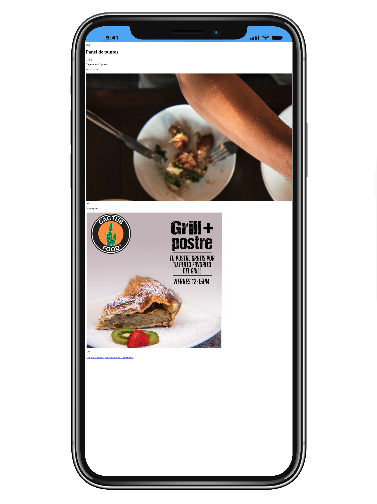
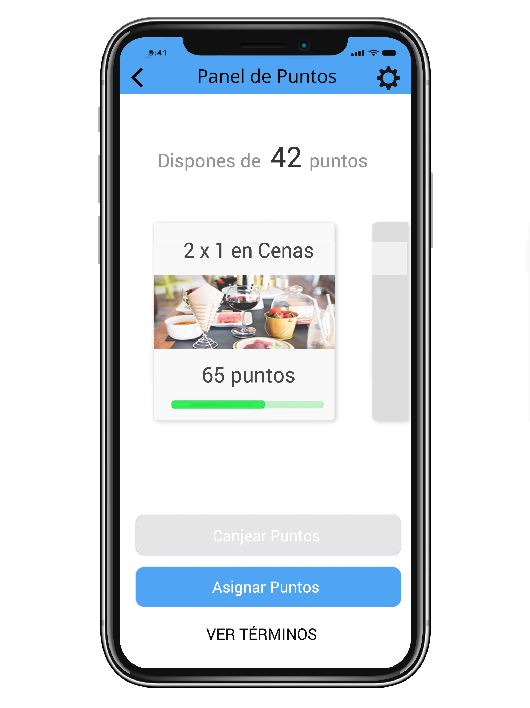

# FrontendAngularCss

A simple Angular 7 project for testers and trainees

## What do we expect?

We expect that the amount of effort to the exercise is in the range of about 2-3 hours of actual work. We also understand that your time is valuable, and in anyone's busy schedule that constitutes a fairly substantial chunk of time, so we really appreciate any effort you put into helping us build a solid team.

## What we are looking for?
Keep it simple. Really. 2-3 hours isn't a lot of time and we really don't want you spending too much more time on it than that.

> **Treat it like production code.** But Keep it simple.

That is, develop your software in the same way that you would for any code that is intended to be deployed to production. These may be toy exercises, but we really would like to get an idea of how you build code on a day-to-day basis.

## How to submit?
You can do this however you see fit - you can email us a tarball, a pointer to download your code from somewhere or just a link to a source control repository. Make sure your submission includes a small README, documenting any assumptions, simplifications and/or choices you made, as well as a short description of how to run the code. Finally, to help us review your code, please split your commit history in sensible chunks (at least separate the initially provided code from your personal additions).

## The Exercise

Actually the project has this look:

 

And we want to style it to look like:

 

That is the main goal.
Take a deep look and be careful with the little details:

- The back and config buttons
- The carousel
- The progress bars
- The bottom buttons

Also it would be great if you can improve a little bit the design and show your creative ideas.

Our main goal is to evaluate your css & html skills, but also we want to see your javascript... 
The carousel must need some javascript or maybe some external library.
The back and config icons must be an image or maybe a custom font like https://ionicons.com/


## Development server

This project was generated with [Angular CLI](https://github.com/angular/angular-cli) version 7.0.3.

If you dont have installed angular CLI, use this command:
```
npm install -g @angular/cli
```

Run `ng serve` for a dev server. Navigate to `http://localhost:4200/`. The app will automatically reload if you change any of the source files.

## Further help

To get more help on the Angular CLI use `ng help` or go check out the [Angular CLI README](https://github.com/angular/angular-cli/blob/master/README.md).
